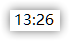
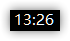
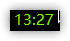
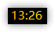

# miniclock
A really tink Numeric clock for windows 

## 下载
进入这里下载最新版 → [release](https://github.com/kasusa/miniclock/releases) 

## 软件介绍
你是一个windows使用者, 你喜欢把你的任务栏隐藏起来，但是你又需要时不时的看看时间。
or 你喜欢玩游戏,但是某些游戏的gui不自带时间显示(可以配合Borderless Gaming一起使用)

这个软件可以在你的屏幕上显示时间，左上角或者右上角、或者像苹果的刘海一样放到中间，任你选择。

## 截图

屏幕截图：

实际使用截图：

### 未来
* 自定义主题
* 更好的半透明主题
* 支持多屏幕（选择）
* 支持保存自定义配置（大小颜色位置）

<!-- 
## 更新日志

### 2021-7-16 

v 1.7

增加了调整字体的功能。（原由是我发现我新的高分辨率的笔记本150%缩放下宋体显示效果很垃圾。）

优化了设置界面的样子

### 2021-6-23 

v1.6 

增加了边框大小调节功能。

重写了设置存储和读取，提取了新的类。

### 2021-6-8 

- 删除了宽度调节功能
- 更换了新字体
- 增加了把他放在屏幕顶部中心位置的功能
- 增加了dpi自动适配
- 更改了菜单颜色、菜单多余内容删除

### 2021-1-9

* 增加了宽度调节功能（经过我的测试，发现在不同分辨率，缩放比例下显示的时候有时时间文字会显示不全，所以增加了这个功能）
* 修复了hacker_style的有时候按钮有用，有时候没有用的bug（之前的代码逻辑有点问题）

### 2020-10-10

* 自动保存--现在保存是在更改的时候触发而不是退出的时候(这样有时候关机前没有关闭程序,之前的设置也可以保存了)
* 为了更加不混乱的 Alt-Tab 菜单,让其不在 Alt-Tab 菜单中显示

### 2020-9-20   

* 增加了按钮快捷键(右键miniclock,出现菜单后按快捷键[有下划线标记])
* 保证了颜色不会重复(取消了随机,现在是顺序播放颜色)

 -->

